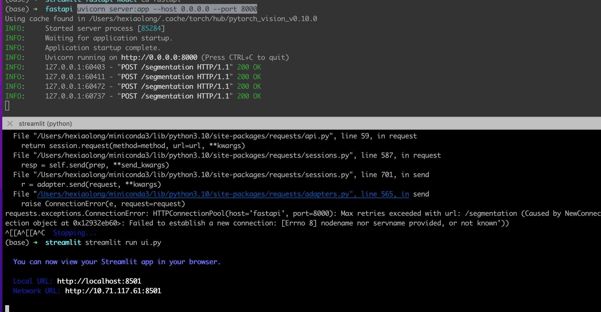
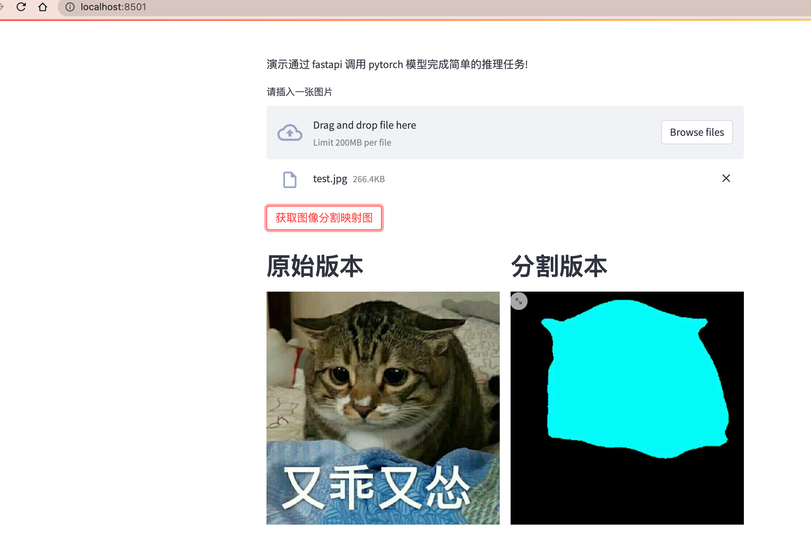

# Streamlit-fastapi 部署推理模型

本实验基于 Pytorch 现有模型 [deeplabv3](https://pytorch.org/hub/pytorch_vision_deeplabv3_resnet101/) 演示如何快速的完成模型的部署.

Streamlit 是一个比较好用的前端库,FastAPI是近些年在社区比较火的后端接口开发库,通过简单的几行代码,我们就可以将自己深度学习训练好的模型部署在互联网上供客户使用.

# 开始使用

直接在本地安装好 Docker环境,执行如下命令即可完成模型的部署.

```bash
docker-compose up -d
```

## 启动后端服务


 ```bash
uvicorn server:app --host 0.0.0.0 --port 8000
 ```


 ## 启动前端服务

 ```bash
 streamlit run ui.py
 ```

 



